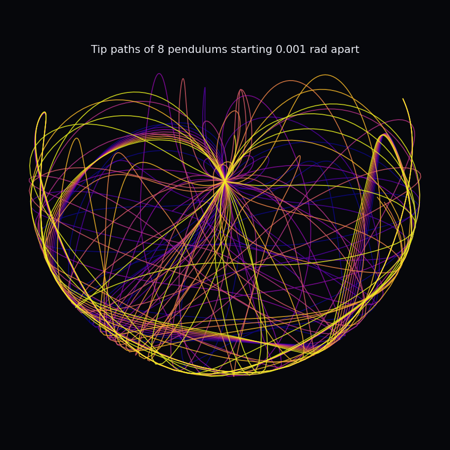

# Double Pendulum &middot; Chaos Visualizer


An interactive visualizer for **deterministic chaos**. A double pendulum is fully
described by four numbers, yet two pendulums released a thousandth of a radian
apart end up completely uncorrelated within seconds. This simulates a whole
ensemble of them and animates the moment they peel apart.



> Tip paths of 8 pendulums whose starting angles differ by just 0.001 rad. They
> trace the same curve at first, then diverge into totally different motion: the
> fingerprint of chaos and sensitive dependence on initial conditions.

**Python backend** (`dpend/`) integrates the equations of motion; a **Flask** API
serves the trajectories; a **Canvas** front-end animates the pendulums with
glowing tip trails.

## Tech stack

- **Python 3 + NumPy** — Lagrangian equations of motion + RK4 integrator
- **Flask** — JSON API (`/api/simulate`) returning the ensemble's frames
- **HTML5 Canvas + vanilla JS** — real-time animation with motion-blur trails
- **Matplotlib** — the static tip-path demo image

## How it works

**The model.** The double pendulum's equations of motion come from its
Lagrangian. They are nonlinear and coupled (the motion of each arm depends on the
other), so there's no closed-form solution. The state is four numbers,
`[theta1, omega1, theta2, omega2]`, and it's advanced with a 4th-order
**Runge-Kutta** integrator, the same one used in my projectile and lap-time
projects.

**Checking accuracy with physics.** An undamped pendulum conserves total energy,
so the simulator computes energy at the start and end of every run; the tests
require it to hold to better than 1 part in 10,000 over 15 seconds. If the
integration ever drifts, that number blows up and a test fails.

**Showing chaos.** The ensemble runs N pendulums whose initial angle differs by
0.001 rad. Their tips start within a centimeter of each other and end up meters
apart, which the tests assert directly. The web view colors each one a different
hue so you watch a single trail split into many.

## Features

- Adjustable starting angles, mass ratio, length ratio, and ensemble size
- Real-time canvas animation with fading tip trails
- Energy-conservation check used as an accuracy gauge
- Works offline: if the Flask backend isn't running, the page loads a
  pre-generated default ensemble (GitHub Pages friendly)
- Unit tests for energy conservation, the rest equilibrium, geometric reach, and
  chaotic divergence

## How to run

```bash
pip install -r requirements.txt

python server.py        # then open http://localhost:5050  (interactive)
python generate_data.py # refresh the static demo + web/data.json
python -m pytest        # or: python tests/test_dpend.py
```

## What I learned

- How to go from a Lagrangian to equations of motion to a numerical integrator,
  and why energy conservation is the cleanest way to know the integrator is sound.
- A concrete feel for "sensitive dependence on initial conditions": 0.001 rad
  becomes meters of difference in seconds, and no amount of measurement precision
  fixes it.
- The same backend-to-browser pattern as my F1 sim: a Python engine behind a
  small JSON API, with a static fallback so the demo runs anywhere.

## How it could be improved

- Add adjustable damping and a driving torque to explore limit cycles.
- Plot the divergence on a log scale to estimate the Lyapunov exponent.
- Let the user drag the bobs to set the initial condition by hand.
